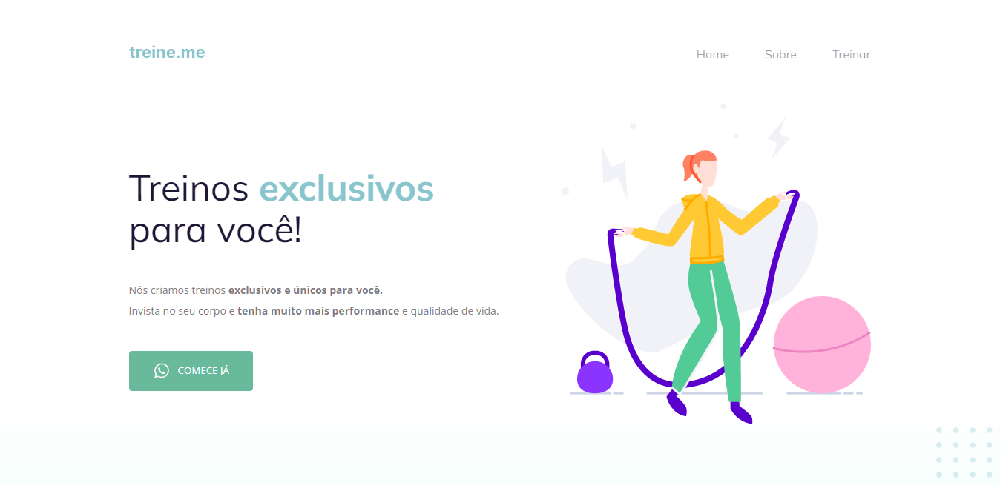

# Treine.me

# Sobre o projeto / About the project

Neste desafio foi feito com a inteção de corrigir os bugs que estavam no HTML da página.

This challenge was done with the intention of correcting bugs that was in the HTML of the page.

## Layout

# Tecnologias utilizadas / Tech stack
- HTML
- CSS
- Figma
- Git & Github

## Autor

